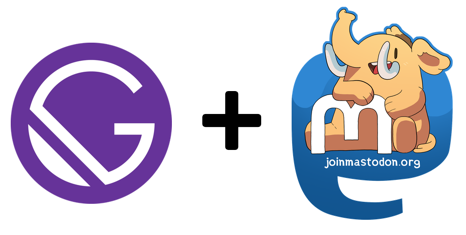

# gatsby-source-mastodon



A Gatsby source plugin for fetching user toots from Mastodon.

Currently only support a user's own toots.

## Usage

You will need to create an `Application` with `read` permission from your Mastodon instance (e.g. https://aus.social/settings/applications).

Add the following block of configuration into your `gatsby-config.js`. Replace fields surrounded by `***` with the correct details.

```javascript
module.exports = {
  plugins: [
    {
      resolve: 'gatsby-source-mastodon',
      options: {
        // The api url of your mastodon instance (e.g https://aus.social/api/v1)
        api_url: '***MASTODON_INSTANCE_API_URL***',
        // Number of toots to return
        limit: 25,
        // Access token for your Mastodon application
        access_token: '***MASTODON_ACCESS_TOKEN***',
      },
  ],
}
```

## Query Mastodon Data

A sample of the query is included below, for all available field please check the graphl browser.

```graphql
{
  allToot {
    edges {
      node {
        id
        url
        reblogs_count
        favourites_count
        account {
          username
        }
      }
    }
  }
}
```
